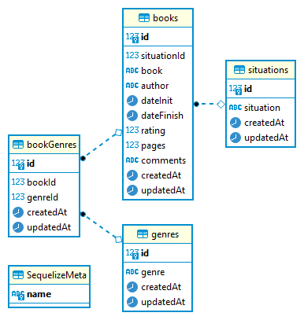

<h1> Database </h1>

 
Actually I created a <strong>postgreSQL</strong> database because I'm already used with it. But I needed a database that stay in cloud because availability, so I choose create my DataBase in <strong>Supabase</strong> a cloud service. 

My intent is use this database in all the parts of the Personal Indicators project. Now I just have datas about the part of Books in this project.

 <strong><i>
So to understand about the data structure of this project about books, I will put a image of the ERD (Entity Relationship Diagram)
</i></strong>
 
<h2 align="center"> Entity Relationship Diagram </h2>

 

